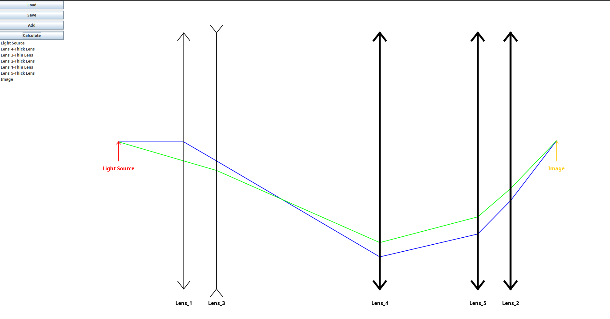

# 🎬 OptiSim Tutorial Video

Welcome to the official **OptiSim** tutorial!

This video will walk you through everything you need to get started with OptiSim — from installation to using the GUI and integrating it as a C++ or Python library.

## 📹 Watch the Video

> Click the thumbnail or [watch on YouTube](https://www.youtube.com/watch?v=60V1-e22O98)

---

## 📖 What You'll Learn

In this tutorial, you'll see:

- ✅ How to add lenses to the system 
- ✅ How to modify and delete optical elements
- ✅ How to get information about the image.
- ✅ How save or load a system from file.

---

We hope you enjoy using **OptiSim** — and this video helps you get the most out of it!